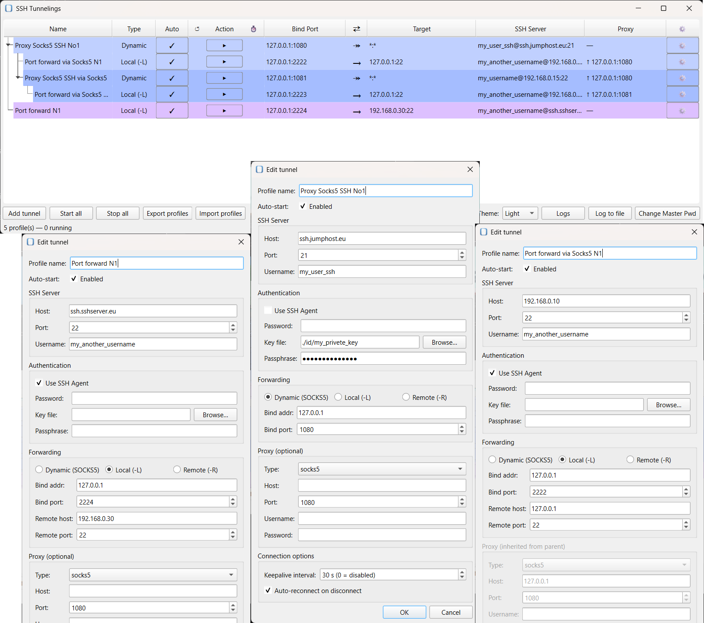
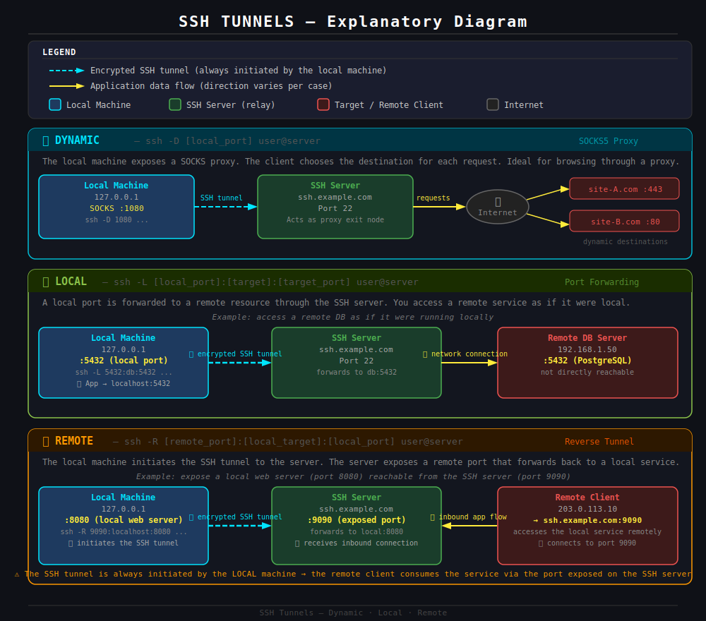
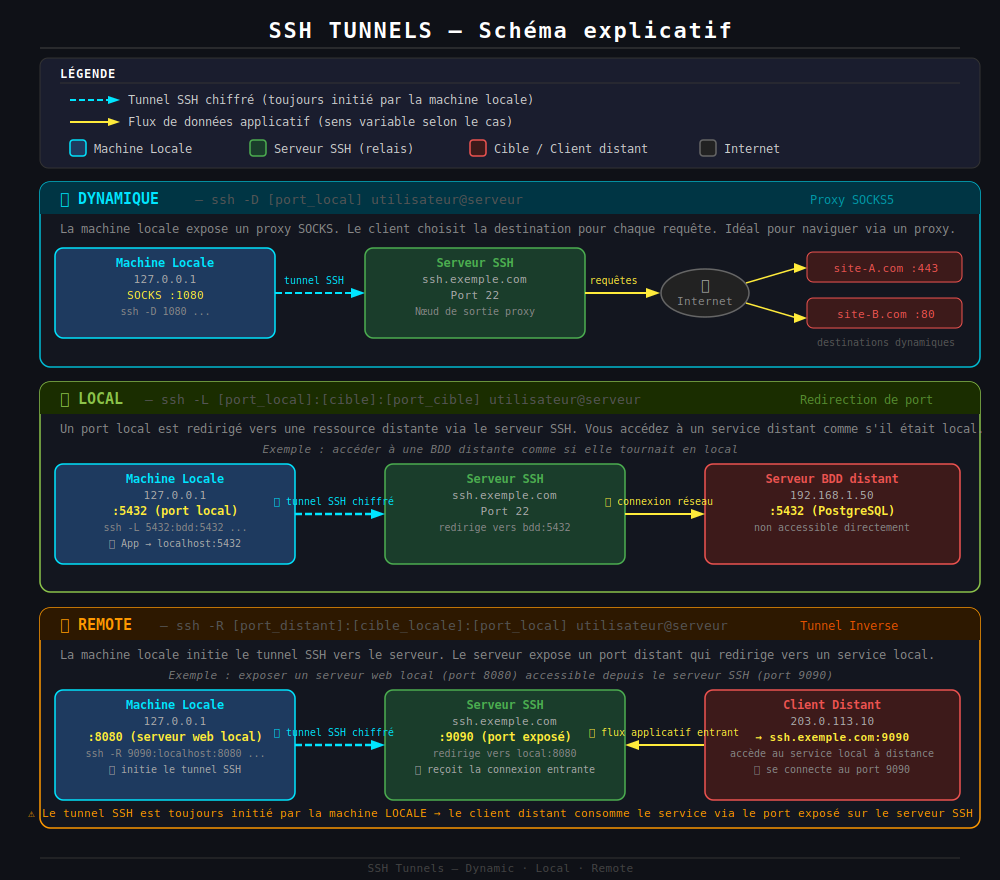

# SSH Tunnel GUI

A desktop application to manage SSH tunnels with a graphical interface.  
Une application desktop pour gérer des tunnels SSH avec une interface graphique.



---

## English

### What is it?

SSH Tunnel GUI lets you create and manage SSH tunnels (local port forwarding,
dynamic SOCKS5 proxy, remote forwarding) through a graphical interface.
Tunnels can be chained hierarchically — for example, routing a connection
through an intermediate SOCKS5 proxy tunnel — and reconnect automatically
on failure. Credentials are stored encrypted with a master password.

### How SSH tunnels work



### Features

- Local, Dynamic (SOCKS5), and Remote SSH tunnel types
- Hierarchical tunnel chaining (route traffic through other tunnels)
- Encrypted profile storage (PBKDF2-SHA256 + Fernet, master password)
- Auto-reconnect with exponential backoff (5 → 10 → 30 → 60 s)
- Import/export profiles with per-conflict resolution
- Optional master password storage via OS keyring
- Proxy support (SOCKS5, SOCKS4, HTTP) with optional authentication
- SSH agent support for passwordless authentication (see below)

### Requirements

- Python 3.10+
- Dependencies listed in `requirements.txt`

### Installation

```bash
pip install -r requirements.txt
```

### Usage

```bash
python ssh_tunnel.py
```

On first launch you will be asked to create a master password used to encrypt
stored SSH credentials (passwords, passphrases, key file paths, proxy passwords).

### SSH Agent support

The application supports passwordless authentication via SSH agents. Enable the
**"Use SSH Agent"** option in a profile's configuration to let the agent handle
key authentication automatically.

The following agents are supported transparently via [Paramiko](https://www.paramiko.org/):

| Agent | Platform |
|-------|----------|
| OpenSSH agent (`ssh-agent`) | Linux, macOS, Windows 10+ (built-in) |
| PuTTY Pageant | Windows |
| GPG agent (SSH mode) | Linux, macOS |
| KeePassXC (SSH agent) | Linux, macOS (via `SSH_AUTH_SOCK`), Windows (via Pageant) |
| 1Password (SSH agent) | Linux, macOS, Windows |

No additional configuration is needed in the application — as long as your agent
is running and holds the relevant key, it will be used automatically.

### Build a standalone executable

The project can be compiled into a single self-contained file using
[Nuitka](https://nuitka.net/). The result runs without requiring Python to be
installed on the target machine.

**Install Nuitka:**

```bash
pip install --upgrade wheel setuptools nuitka
```

**Compile (Windows):**

```bash
python -m nuitka --onefile --remove-output --standalone \
    --enable-plugin=pyqt6 \
    --windows-console-mode=disable \
    --windows-icon-from-ico=logo.ico \
    --include-data-files=logo.ico=logo.ico \
    ssh_tunnel.py
```

This produces a single `ssh_tunnel.exe` file.

> **Linux / macOS:** remove `--windows-console-mode` and `--windows-icon-from-ico`.
> Use `--linux-icon` or `--macos-app-icon` for the icon if needed.

### History

Following a career shift — from hosted platform administration to application
development for system administration, operations, and automation — I wanted to
fill a gap in practical tooling: existing alternatives were either non-existent
or paid without being particularly user-friendly.

This project also serves a secondary purpose: learning how to build complex
applications with a graphical interface. Python was the natural choice, as it is
the language I use daily.

From the start, I aimed for a cross-platform tool targeting primarily Windows and
Linux (macOS should work too).

The program started with SSH thread management and a Tkinter interface. The
original code was functional but rough — and Tkinter does not help much on the
ergonomics side. I gradually improved the interface, first using a local AI model
with manual tweaks. It was good enough for my own use, without being truly polished.

I recently subscribed to an Anthropic Pro plan to deepen my work on code
architecture, and chose this project as a testbed. The GUI was entirely rewritten
in **PyQt6** with the help of [Claude](https://claude.ai), replacing Tkinter with
something far more modern and ergonomic. The result surprised me: the application
became significantly more accessible and better structured — which is what led me
to make it public.

### Contributing

Contributions are welcome! Open an issue or submit a pull request to suggest
improvements, report bugs, or add new features.

### License

GNU General Public License v3.0 — see [LICENSE](LICENSE).

---

## Français

### À quoi ça sert ?

SSH Tunnel GUI permet de créer et gérer des tunnels SSH (redirection de port locale,
proxy SOCKS5 dynamique, redirection distante) via une interface graphique.
Les tunnels peuvent être chaînés hiérarchiquement — par exemple, faire transiter
une connexion par un tunnel proxy SOCKS5 intermédiaire — et se reconnectent
automatiquement en cas de coupure. Les identifiants sont chiffrés avec un mot de
passe maître.

### Fonctionnement des tunnels SSH



### Fonctionnalités

- Types de tunnels : local, dynamique (SOCKS5) et distant
- Chaînage hiérarchique (faire transiter le trafic par d'autres tunnels)
- Stockage chiffré des profils (PBKDF2-SHA256 + Fernet, mot de passe maître)
- Reconnexion automatique avec backoff exponentiel (5 → 10 → 30 → 60 s)
- Import/export de profils avec résolution des conflits profil par profil
- Stockage optionnel du mot de passe maître dans le trousseau OS
- Support proxy (SOCKS5, SOCKS4, HTTP) avec authentification optionnelle
- Support des agents SSH pour une authentification sans mot de passe (voir ci-dessous)

### Prérequis

- Python 3.10+
- Dépendances listées dans `requirements.txt`

### Installation

```bash
pip install -r requirements.txt
```

### Lancement

```bash
python ssh_tunnel.py
```

Au premier lancement, vous serez invité à définir un mot de passe maître utilisé
pour chiffrer les identifiants SSH stockés (mots de passe, passphrases, chemins
de clés privées, mots de passe proxy).

### Support des agents SSH

L'application supporte l'authentification sans mot de passe via les agents SSH.
Activez l'option **"Use SSH Agent"** dans la configuration d'un profil pour laisser
l'agent gérer l'authentification par clé automatiquement.

Les agents suivants sont supportés de manière transparente via [Paramiko](https://www.paramiko.org/) :

| Agent | Plateforme |
|-------|------------|
| OpenSSH agent (`ssh-agent`) | Linux, macOS, Windows 10+ (intégré) |
| PuTTY Pageant | Windows |
| GPG agent (mode SSH) | Linux, macOS |
| KeePassXC (agent SSH) | Linux, macOS (via `SSH_AUTH_SOCK`), Windows (via Pageant) |
| 1Password (agent SSH) | Linux, macOS, Windows |

Aucune configuration supplémentaire n'est nécessaire dans l'application — tant que
votre agent est actif et contient la clé concernée, il sera utilisé automatiquement.

### Compiler un exécutable autonome

Le projet peut être compilé en un fichier unique et autonome avec
[Nuitka](https://nuitka.net/). Le résultat s'exécute sans que Python soit installé
sur la machine cible.

**Installer Nuitka :**

```bash
pip install --upgrade wheel setuptools nuitka
```

**Compiler (Windows) :**

```bash
python -m nuitka --onefile --remove-output --standalone \
    --enable-plugin=pyqt6 \
    --windows-console-mode=disable \
    --windows-icon-from-ico=logo.ico \
    --include-data-files=logo.ico=logo.ico \
    ssh_tunnel.py
```

Cela produit un fichier `ssh_tunnel.exe` unique.

> **Linux / macOS :** supprimer `--windows-console-mode` et `--windows-icon-from-ico`.
> Utiliser `--linux-icon` ou `--macos-app-icon` pour l'icône si nécessaire.

### Histoire du projet

Suite à une réorientation professionnelle — de l'administration de plateformes
hébergées vers le développement d'applications pour l'administration système,
l'exploitation et l'automatisation — j'ai voulu combler un manque d'outils
pratiques : les alternatives existantes étant soit absentes, soit payantes sans
être vraiment ergonomiques.

Ce projet a aussi une vocation formative : m'exercer au développement d'applications
complexes avec interface graphique. Python s'est imposé naturellement, c'est le
langage que j'utilise au quotidien.

Dès le départ, j'ai voulu un outil multiplateforme, ciblant en priorité Windows et
Linux (macOS devrait fonctionner aussi).

Le programme a démarré avec la gestion des threads SSH et une interface Tkinter.
Le code d'origine était fonctionnel mais sommaire — et Tkinter ne facilite pas les
choses côté ergonomie. J'ai ensuite amélioré l'interface progressivement, d'abord
avec une IA en local et des retouches manuelles. C'était suffisant pour mon usage,
sans être vraiment abouti.

J'ai récemment souscrit un abonnement Pro chez Anthropic pour approfondir mon
travail sur l'architecture du code, et j'ai choisi ce projet comme terrain
d'application. L'interface a été entièrement réécrite en **PyQt6** avec l'aide de
[Claude](https://claude.ai), remplaçant Tkinter par quelque chose de bien plus
moderne et ergonomique. Le résultat m'a surpris : l'application est aujourd'hui
bien plus accessible et mieux structurée — ce qui m'a décidé à la rendre publique.

### Contribuer

Les contributions sont les bienvenues ! Ouvrez une issue ou soumettez une pull request
pour proposer des améliorations, signaler des bugs ou ajouter de nouvelles
fonctionnalités.

### Licence

GNU General Public License v3.0 — voir [LICENSE](LICENSE).
